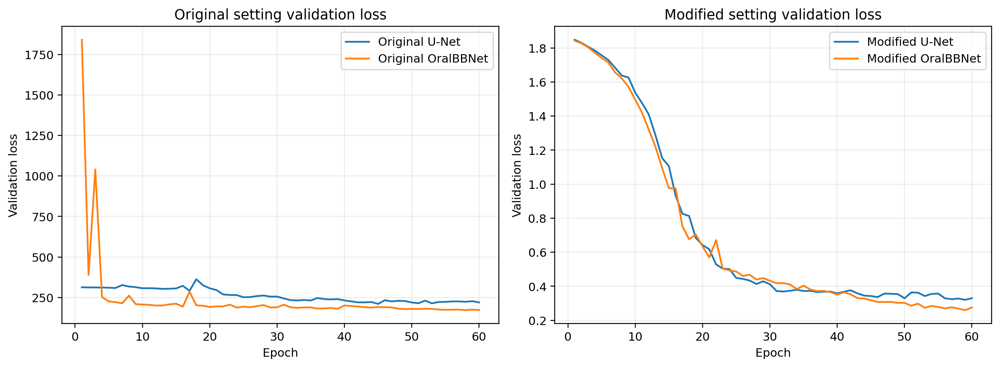
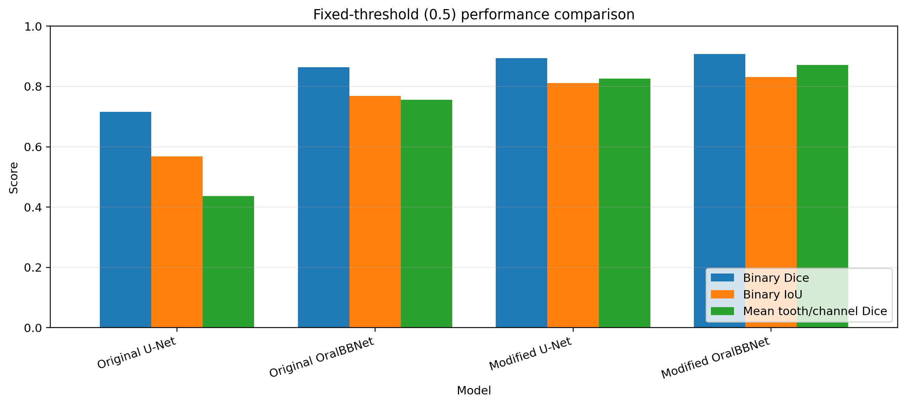
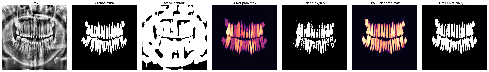
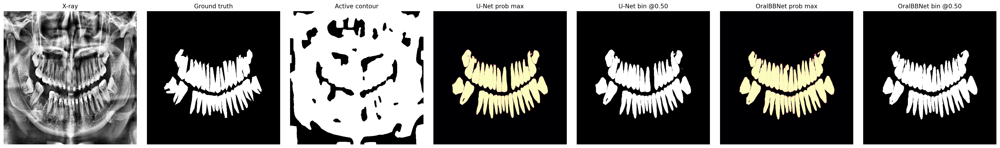

# Instance Segmentation of Teeth in Panoramic X-rays: Active Contour, U-Net, and Modified OralBBNet

## Cover Page

**Course:** ECE3070 Medical Image Analysis

**Project title:** Instance Segmentation of Teeth in Panoramic X-rays: Active Contour, U-Net, and Modified OralBBNet

**Team information:**

- Name 1, Student ID 1
- Name 2, Student ID 2

**Member contributions:**

- Member A: U-Net and OralBBNet method development, model training, hyperparameter configuration, quantitative evaluation, and result analysis.
- Member B: data preprocessing, dataset indexing, Active Contour baseline, YOLO bounding-box label parsing, visualization, and report writing.

## 1. Overview

This project studies tooth instance segmentation in panoramic dental X-rays. The task is to predict 32 permanent tooth-position masks following the FDI numbering system. Compared with ordinary binary tooth segmentation, this is harder because the model must both locate tooth pixels and assign them to the correct tooth channel.

Two experimental settings are used in the final comparison:

- **Reference OralBBNet**: the reproduction-oriented baseline that keeps the original OralBBNet-style training configuration as much as possible, including softmax output, Dice+L2 loss, Adam learning rate `3e-4`, dropout `0.12`, 60 epochs, global batch size 2, and fixed threshold `0.5`.
- **Modified OralBBNet**: the proposed method that uses a corrected BCE+DiceLoss objective, sigmoid output, a more stable learning rate, fixed threshold `0.5` for the main comparison, and an additional threshold-calibration analysis.

The main evaluation in this report uses **threshold = 0.5** for both reference and modified experiments. This keeps the comparison aligned with the reference evaluation protocol and avoids over-reporting results from very low tuned thresholds.

The report therefore answers three questions:

1. What was changed from Reference OralBBNet to Modified OralBBNet?
2. How much improvement is observed at the fixed threshold `0.5`?
3. Why does OralBBNet have an advantage over U-Net in terms of segmentation quality, efficiency of supervision, and practical trade-offs?

## 2. Data and Preprocessing

The experiments use the UFBA-425 panoramic X-ray dataset. Each image is converted to grayscale, enhanced with CLAHE, resized to `512 x 512`, and paired with a 32-channel target mask. Each output channel corresponds to one FDI tooth position:

```text
11-18, 21-28, 31-38, 41-48
```


*Figure 1. Example 32-channel FDI annotation. Each color and number corresponds to one tooth-position channel.*


*Figure 2. Example panoramic X-ray with dataset-provided YOLO bounding-box labels. These boxes are converted into spatial prior maps for OralBBNet.*

YOLO-format bounding-box labels are converted into 32-channel spatial prior maps. These prior maps are used only by OralBBNet. U-Net receives only the X-ray image, while OralBBNet receives the concatenation of bounding-box priors and the image.

The two experimental settings use slightly different split logic because they serve different purposes. The reference setting follows the reference configuration more closely: it forms a train pool and test set by category and then takes a validation split from the train pool. The modified setting uses a fixed random `70%/15%/15%` train/validation/test split. Therefore, the exact Active Contour numbers are not identical across the two settings. For model-to-model comparison within each setting, however, all methods use identical splits.

| Item | Reference setting | Modified setting |
| --- | --- | --- |
| Dataset | UFBA-425 | UFBA-425 |
| Total images (with masks) | 425 | 425 |
| Image size | `512 x 512` | `512 x 512` |
| Preprocessing | Grayscale + CLAHE | Grayscale + CLAHE |
| Target | 32 FDI mask channels | 32 FDI mask channels |
| Split | Category-based train/test, then validation from train pool (train/val/test = 313/30/82) | Random `70/15/15` train/validation/test split (train/val/test = 297/64/64) |
| Prior source | YOLO-format labels / fallback boxes | YOLO-format labels / fallback boxes |
| Main threshold | `0.5` | `0.5` |

## 3. Compared Methods

### 3.1 Active Contour

Active Contour is used as the traditional image-processing baseline. We use the Chan-Vese model because it can segment homogeneous regions even when object edges are weak, which is common in panoramic X-rays. The method evolves a contour by minimizing an energy that balances contour smoothness and intensity consistency inside and outside the contour:

\[
E(C, c_1, c_2) =
\mu \mathrm{Length}(C)
+ \lambda_1 \int_{\mathrm{inside}(C)} |I(x)-c_1|^2 dx
+ \lambda_2 \int_{\mathrm{outside}(C)} |I(x)-c_2|^2 dx
\]

Here, \(C\) is the evolving contour, \(I(x)\) is the image intensity, and \(c_1\) and \(c_2\) are the mean intensities inside and outside the contour.

In our pipeline, the X-ray is smoothed, initialized with an Otsu-based mask, refined by Chan-Vese evolution, and post-processed with connected-component filtering. This method is unsupervised and interpretable, so it provides a useful lower-bound comparison. However, it only produces a binary tooth-region mask and cannot identify individual FDI tooth channels.

### 3.2 U-Net

U-Net is the supervised deep-learning baseline. It is widely used in biomedical segmentation because its encoder-decoder structure combines semantic context with spatial detail. The encoder progressively downsamples the image to learn high-level features, while the decoder upsamples the feature maps to recover pixel-level predictions. Skip connections copy fine boundary information from encoder layers to decoder layers, which is important for tooth contours.

In this project, U-Net takes a `512 x 512 x 1` X-ray image and predicts a `512 x 512 x 32` mask tensor. The final 32 channels correspond to the FDI tooth positions. Compared with Active Contour, U-Net can learn tooth appearance from annotations and output tooth-position channels. Its limitation is that it receives only the image; without explicit spatial priors, visually similar neighboring teeth may still be assigned to the wrong channel.

### 3.3 Reference OralBBNet

Reference OralBBNet is the reproduction-oriented baseline adapted from Budagam et al. [3]. Its main idea is to combine detection-level location information with pixel-level segmentation. In the original two-stage pipeline, YOLOv8 first detects and numbers teeth, then its bounding boxes are converted into 32 spatial prior maps. OralBBNet receives these prior maps together with the panoramic X-ray and predicts tooth instance masks.


*Figure 3. Two-stage OralBBNet pipeline. YOLOv8 first provides tooth numbering and bounding boxes, then OralBBNet uses these priors with the X-ray image to output instance masks (source: Budagam et al. [3]).*

Architecturally, OralBBNet is based on a U-Net-like encoder-decoder network. The important difference is the bounding-box branch: it processes the 32 prior maps at multiple scales and uses them to modulate skip-connection features. This encourages each output channel to focus on the anatomical region where the corresponding tooth is expected to appear.


*Figure 4. OralBBNet network structure. The bounding-box branch modulates U-Net skip connections so that segmentation is guided by tooth-location priors (source: Budagam et al. [3]).*

In our reference implementation, we keep the original OralBBNet-style setting as closely as possible: a 33-channel input, softmax output, Adam with learning rate `3e-4`, dropout `0.12`, 60 training epochs, and fixed threshold `0.5` for the main evaluation.

One engineering compatibility fix was required: `tf.multiply(skip, prior)` was replaced by `layers.Multiply()([skip, prior])`. This keeps the mathematical operation unchanged but makes the model build correctly under the current Keras version.

### 3.4 Modified OralBBNet

Modified OralBBNet keeps the spatial-prior design, but changes the output activation and optimization objective. The main differences are summarized below.

**Reference and modified OralBBNet settings.**

| Component | Reference OralBBNet | Modified OralBBNet |
| --- | --- | --- |
| Role | Reference reproduction baseline | Proposed modified method |
| Input | 32 bbox-prior channels + 1 X-ray channel | 32 bbox-prior channels + 1 X-ray channel |
| Output activation | Softmax | Sigmoid |
| Loss | Original Dice + L2-style term | `0.2 * BCE + 0.8 * DiceLoss` |
| Optimizer | Adam, lr `3e-4`, beta1 `0.99` | Adam, lr `1e-4` |
| Gradient clipping | Not used | `clipnorm=1.0` |
| LR scheduler | Halve LR after 5 stagnant validation epochs | `ReduceLROnPlateau`, patience 5 |
| Early stopping | Not used | Patience 12, restore best weights |
| Shared settings | 60 epochs, dropout `0.12`, base filters 64, global batch size 2 | 60 epochs, dropout `0.12`, base filters 64, global batch size 2 |
| Main threshold | `0.5` | `0.5` |
| Extra threshold analysis | No | Yes, validation-set calibration |

The most important modification is the loss. In the original formulation, Dice was used directly inside the minimized objective, even though Dice is a metric that should be maximized. The modified version uses `1 - Dice` and combines it with BCE, making the optimization direction consistent with segmentation quality.

The modified model also uses sigmoid output instead of softmax. This is more suitable for 32 independent tooth-position channels because adjacent teeth are different instances, not a single mutually exclusive semantic class over the whole image.

## 4. Training Setup

Both reference and modified experiments are trained for 60 epochs. The main test evaluation uses a fixed threshold of `0.5`, because this is directly comparable across original and modified settings. A validation-based threshold calibration is also reported as supplementary analysis.

The reference and modified runs use different loss definitions, so their absolute loss scales should not be compared directly. The validation curves are still useful within each setting, and the best validation losses are:

| Model | Epochs trained | Best validation epoch | Best validation loss |
| --- | ---: | ---: | ---: |
| Original U-Net | 60 | 45 | 210.607 |
| Original OralBBNet | 60 | 58 | 172.236 |
| Modified U-Net | 60 | 59 | 0.320 |
| Modified OralBBNet | 60 | 59 | 0.260 |

The modified curves are smoother because the objective uses BCE plus true DiceLoss.



*Figure 5. Validation loss curves for original and modified settings. The loss scales are different because the original and modified objectives are not numerically comparable, but the curves show convergence behavior under each training setup.*

## 5. Fixed-Threshold Results

Table 1 reports the main test-set results at threshold `0.5`. Binary Dice and Binary IoU merge all 32 tooth channels into a tooth-versus-background mask, while mean tooth/channel Dice evaluates whether pixels are assigned to the correct FDI tooth channel.

**Table 1. Test-set performance at threshold 0.5.**

| Experiment | Method | Binary Dice | Binary IoU | Mean tooth/channel Dice |
| --- | --- | ---: | ---: | ---: |
| Original | Active Contour | 0.350 | 0.215 | - |
| Original | U-Net | 0.716 | 0.568 | 0.436 |
| Original | OralBBNet | 0.863 | 0.768 | 0.756 |
| Modified | Active Contour | 0.356 | 0.219 | - |
| Modified | U-Net | 0.894 | 0.811 | 0.826 |
| Modified | OralBBNet | **0.907** | **0.831** | **0.871** |

The modified OralBBNet is best on all three main metrics, reaching `0.907` Binary Dice and `0.871` mean tooth/channel Dice.

The results follow a clear pattern. Active Contour performs worst because panoramic X-rays contain weak tooth boundaries and complex jawbone structures, so region-based contour evolution easily leaks into non-tooth areas. U-Net is much stronger because it learns tooth appearance from annotations, but it still has no explicit knowledge of where each FDI tooth number should appear. OralBBNet performs best because the bounding-box prior reduces the search space for each tooth channel and helps align the prediction with the correct anatomical location.



*Figure 6. Fixed-threshold performance comparison. Modified OralBBNet gives the best overall performance at threshold 0.5.*

## 6. Original OralBBNet vs Modified OralBBNet

The modified OralBBNet improves over the original OralBBNet under the fixed threshold `0.5`:

| Metric | Original OralBBNet | Modified OralBBNet | Absolute gain | Relative gain |
| --- | ---: | ---: | ---: | ---: |
| Binary Dice | 0.863 | 0.907 | +0.044 | +5.1% |
| Binary IoU | 0.768 | 0.831 | +0.063 | +8.2% |
| Mean tooth/channel Dice | 0.756 | 0.871 | +0.115 | +15.2% |

The gain is mainly explained by three changes. First, BCE+DiceLoss aligns the training objective with the Dice-based evaluation: BCE provides stable pixel-level supervision, while DiceLoss directly optimizes mask overlap. Second, sigmoid output treats the 32 tooth channels as independent instance maps, which is more suitable than softmax for neighboring tooth instances. Third, the modified prior gate keeps the bounding-box information useful without overly suppressing skip-connection features. The largest relative gain appears in mean tooth/channel Dice, showing improved channel assignment.

| Tooth group | Original OralBBNet | Modified OralBBNet | Gain |
| --- | ---: | ---: | ---: |
| Incisors | 0.705 | 0.893 | +0.188 |
| Canines | 0.770 | 0.869 | +0.099 |
| Premolars | 0.752 | 0.880 | +0.128 |
| Molars | 0.787 | 0.907 | +0.120 |

The largest gain is observed for incisors, which are relatively small and close to the image midline.

This tooth-group result is useful because the four groups are mutually exclusive and represent different anatomical difficulties. Incisors and canines are smaller and more easily confused near the midline, while molars are larger but can overlap with roots and jaw structures. The consistent gain across all groups suggests that the modified OralBBNet improves both small-tooth localization and larger-tooth boundary alignment.



*Figure 7. Qualitative result from the original OralBBNet setting.*



*Figure 8. Qualitative result from the modified OralBBNet setting.*

## 7. OralBBNet vs U-Net

OralBBNet outperforms U-Net in both experimental settings. In the original setting, it improves over U-Net by `+0.147` Binary Dice and `+0.320` mean tooth/channel Dice. In the modified setting, U-Net becomes stronger, but OralBBNet still improves Binary Dice from `0.894` to `0.907` and mean tooth/channel Dice from `0.826` to `0.871`.

The trade-off is that OralBBNet is heavier and depends on prior boxes:

| Aspect | U-Net | OralBBNet |
| --- | --- | --- |
| Input channels | 1 image channel | 32 prior channels + 1 image channel |
| Checkpoint size | Smaller, about 396 MB | Larger, about 435 MB |
| Computation | Faster and simpler | Slower due to prior-gating branch |
| Inference requirement | X-ray only | X-ray + bounding-box prior |
| Main advantage | Simplicity | Better tooth identity alignment |
| Main limitation | No explicit tooth-location prior | Sensitive to prior-box quality |

This supports the main interpretation: U-Net learns strong tooth foreground segmentation, but OralBBNet is more suitable for structured 32-channel dental charting because spatial priors reduce channel confusion.

This is important because the task is not only binary tooth segmentation. Binary Dice becomes high when the model finds tooth pixels, even if neighboring teeth are confused. Mean tooth/channel Dice is stricter: it penalizes assigning pixels to the wrong FDI channel. OralBBNet improves this stricter metric because each prior channel gives the decoder a location cue for one tooth position. In other words, U-Net mainly learns "where teeth are" from image appearance, while OralBBNet also learns "which tooth should be where" from the spatial prior.

In terms of efficiency, U-Net remains the simpler model and is preferable when only X-ray images are available at inference. OralBBNet is more demanding because a detector or bounding-box source is needed before segmentation. The current logs do not record exact wall-clock time per epoch, so this report does not claim a precise timing advantage. Instead, the comparison shows a practical trade-off: U-Net is lighter, while OralBBNet gives better tooth identity alignment under the fixed `0.5` evaluation protocol.

## 8. Discussion

The supplementary threshold-calibration experiment shows that lower thresholds can slightly increase Dice, but thresholds as low as `0.05` indicate imperfect probability calibration. Therefore, threshold `0.5` remains the main conservative comparison.

| Method | Tuned threshold | Binary Dice | Binary IoU | Mean tooth/channel Dice |
| --- | ---: | ---: | ---: | ---: |
| Modified U-Net tuned | 0.05 | 0.896 | 0.813 | 0.827 |
| Modified OralBBNet tuned | 0.05 | 0.909 | 0.834 | 0.871 |

The main limitation is that the OralBBNet prior maps are built from dataset-provided YOLO labels or fallback boxes. This means the experiment evaluates the benefit of spatial priors, but not the full deployment pipeline. In practice, missing or inaccurate boxes could mislead the prior-gating branch. A complete clinical pipeline should train a detector and evaluate segmentation using predicted boxes, not annotation-derived boxes. Further work should also analyze difficult cases such as missing teeth, implants, restorations, and very low-contrast X-rays.

## 9. Conclusion

At threshold `0.5`, the modified OralBBNet achieves the best overall result: `0.907` Binary Dice, `0.831` Binary IoU, and `0.871` mean tooth/channel Dice. Compared with the original OralBBNet, it improves mean tooth/channel Dice by `0.115`; compared with the modified U-Net, it improves that metric by `0.045`.

Overall, Active Contour is interpretable but insufficient, U-Net is a strong and efficient baseline, and OralBBNet is the best choice when accurate 32-channel tooth identity assignment is required. Future work should train the full YOLOv8 detection stage, evaluate predicted rather than annotation-derived priors, and improve probability calibration.

## References

[1] O. Ronneberger, P. Fischer, and T. Brox. U-Net: Convolutional Networks for Biomedical Image Segmentation. In *Medical Image Computing and Computer-Assisted Intervention (MICCAI)*, 2015.

[2] T. F. Chan and L. A. Vese. Active Contours Without Edges. *IEEE Transactions on Image Processing*, 10(2):266-277, 2001.

[3] D. Budagam et al. OralBBNet: Spatially Guided Dental Segmentation of Panoramic X-Rays with Bounding Box Priors. *arXiv preprint arXiv:2406.03747*, 2025.

[4] D. P. Kingma and J. Ba. Adam: A Method for Stochastic Optimization. In *International Conference on Learning Representations (ICLR)*, 2015.

[5] G. Jocher, A. Chaurasia, and J. Qiu. Ultralytics YOLOv8. https://github.com/ultralytics/ultralytics, 2023.

[6] G. Jader, L. Oliveira, and M. M. Pithon. Automatic Segmenting Teeth in X-ray Images: Trends, a Novel Data Set, Benchmarking and Future Perspectives. *arXiv preprint arXiv:1802.03086*, 2018.

[7] K. Zuiderveld. Contrast Limited Adaptive Histogram Equalization. In *Graphics Gems IV*, pp. 474-485, Academic Press, 1994.
